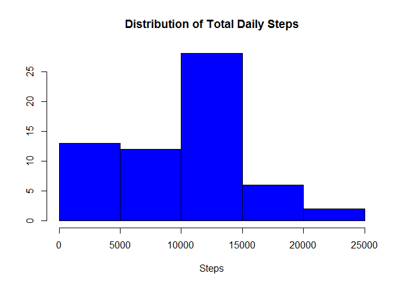
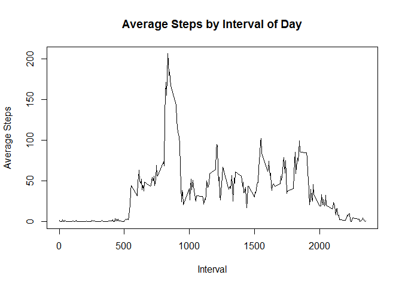
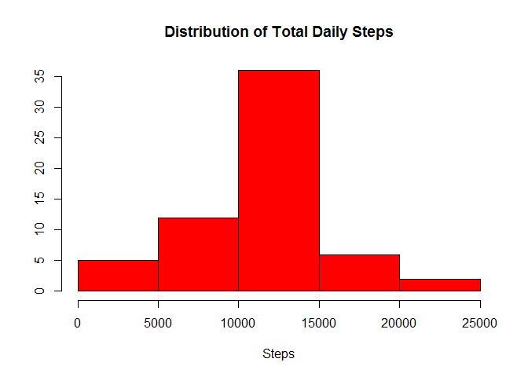
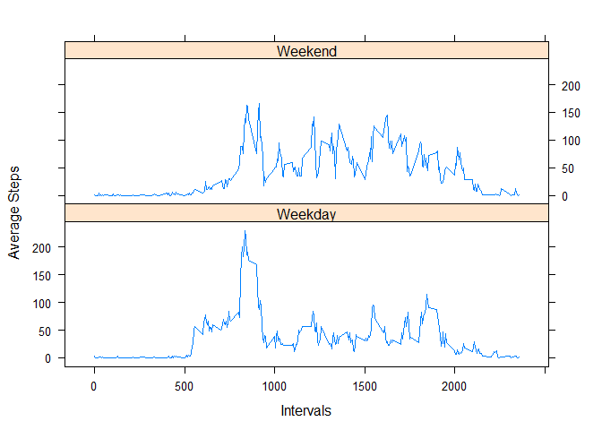

# Reproducible Research: Peer Assessment 1


### Loading and preprocessing the data

Assuming the data has been extracted from the provided link and into the working directory.
The data will be read into R as follows  


```r
	act <- read.csv("activity.csv")
	act$date <- as.Date(act$date)
```
  
### What is mean total number of steps taken per day?
  
In order to examine the summary of steps, the data first needs to be aggregated by day.


```r
	day_ttl <- aggregate(act$steps, list(act$date), sum, na.rm=T)
	colnames(day_ttl) <- c("date", "total_steps")
```

Now, a quick histogram will show the distribution of total steps.
  
 
  
With the majority of days finishing with between 10k and 15k steps, the mean and median will 
also be in that range. In fact, after removing NA values, the mean total daily steps is 
**9354.23** and the median is **10395**
   

### What is the average daily activity pattern?

Similar to before, the data needs to be aggregated by interval before we can examine the average daily pattern. 


```r
	ivl_avg <- aggregate(act$steps, list(act$interval), mean, na.rm=T)
	colnames(ivl_avg) <- c("interval", "avg_steps")
```

The average activity pattern can now be plotted across intervals. 

 

Interval number **835** has the maximum value 
with an average of **206.1698** steps.

### Imputing missing values

However, it turns out there are quite a few missing values in the original dataset. In fact, there are 
**2304** records with missing step values. The following snippet of R code, goes through the dataset and 
replaces those missing values with the average steps by 5-minute interval demonstrated above. 


```r
	act_fill <- act
	for(i in 1:nrow(act)) {
		if(is.na(act$steps[i])) { 
			newsteps <- ivl_avg[ivl_avg$interval==act$interval[i],2]
			act_fill$steps[i] <- newsteps
		} else { act_fill$steps[i] <- act$steps[i]}
	}
```
Next, the day totals will be aggregated on the new dataset and a new histogram charted.


```r
	new_ttl <- aggregate(act_fill$steps, list(act_fill$date), sum)
	colnames(new_ttl) <- c("date", "total_steps")
```
 

After replacing missing values with the interval average, the mean total daily steps is 
**10766.19** and the median is **10766.19** which are higher
than the mean and median when ignoring missing values. By replacing the missing values with the average 
interval steps, days that previously had zero steps due to missing values now have average steps. 

### Are there differences in activity patterns between weekdays and weekends?

First a factor will be created and added to the dataset in order to differentiate between weekdays and weekends. 


```r
	daytype <- weekdays(act_fill$date)
	for (i in 1:nrow(act_fill)) {
		if(daytype[i]=="Saturday"|daytype[i]=="Sunday") { 
			daytype[i] <- "Weekend" 
		} else { daytype[i] <- "Weekday"}
	}
	act_fill <- cbind(act_fill, daytype)
	act_fill$daytype <- factor(act_fill$daytype)
	new_ivl_avg <- aggregate(act_fill$steps, list(act_fill$interval, act_fill$daytype), mean)
	colnames(new_ivl_avg) <- c("interval", "daytype", "avg_steps")
```

A panel chart comparing weekdays to weekends will give us a quick indicator of any major differences. 

 

As you can see the weekends tend to be more active throughout the day and the weekdays have a spike of 
activity early on in the day. 
